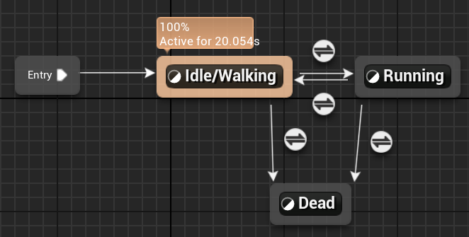
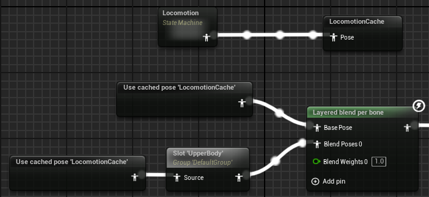

Check out **Terminal's**
- 🕹️ [**Game Page**](https://henryha993.itch.io/terminal)
- 💾 [**Project Files**](https://github.com/HenryHa993/MBShooter)

## About
Terminal is a horror shooter made using **C++** and **UE5**. This project contains 4 *unique* enemies, which undergo different animations and AI.

This is a personal remake of a group project made during my time at [The Developer Academy's](https://thedeveloperacademy.com/) Unreal Engine 5 bootcamp. Big thanks to [Clayton Rist](https://www.linkedin.com/in/clayton-rist-027185171/?originalSubdomain=uk) who contributed with the original level construction, playtesting and the blaster sound.

This project was initially a zombie shooter with bare-bones AI and animation implementation. Upon revisit, I wanted to improve on those fronts and develop behaviours which take advantage of **layered animations** and Unreal Engine's **EQS**.

Most of these components are done using C++ and may be documented further in the **Related Posts** section.

## Techniques
The primary focus of this project was to make believable and varied behaviours. Below you can see some of the techniques used to achieve the gameplay and enemies you see in Terminal.

### Artificial Intelligence
1. **Behaviour Trees**
    - **Tasks** and **services** done in **C++**.
    - Below is a charge attack sequence.
    
2. **Environment Query System**
    - Used to calculate locations for the hiding and strafing behaviours.
    - Incorporated into behaviour trees.

### Animation Programming
1. **Animation Blueprints**
    - **State Machines** used to switch between **blendspaces**.
    
    - **Event Graphs** done in **blueprints** in order to update variables used in the **state machines**.
2. **Layered Animations**
    - Blended animations by bone in order to create more natural movements and attacks.
    
5. **Blendspaces**
    - Blending of movement animations by direction and speed.

### C++
1. **C++ Anim Notifiers**
    - Used to check player range and apply damage on a specific frame of attack animations.
    ```cpp
    void UAnimNotify_AttackPlayer::Notify(USkeletalMeshComponent* MeshComp, UAnimSequenceBase* Animation)
    {
        Super::Notify(MeshComp, Animation);

        if (!(MeshComp))
        {
            UE_LOG(LogTemp, Warning, TEXT("PlayerController or MeshComponent NULL"));
            return;
        }

        APlayerController* PlayerController = GetWorld()->GetFirstPlayerController();
        AMB2Character* PlayerCharacter = Cast<AMB2Character>(PlayerController->GetPawn());

        AActor* AIActor = MeshComp->GetOwner();

        FVector AILocation = AIActor->GetActorLocation();
        FVector PlayerLocation = PlayerCharacter->GetActorLocation();

        float Distance = FVector::Distance(AILocation, PlayerLocation);

        if(Distance <= AttackRange)
        {
            UGameplayStatics::ApplyDamage(PlayerCharacter, Damage, PlayerController, AIActor, DamageType);
            UE_LOG(LogTemp, Warning, TEXT("Hit, Health: %f"), PlayerCharacter->HealthComponent->GetHealth());
        }
    }
    ```
2. **C++ HealthComponent**
    - Had the health as a separate `ActorComponent` class.
    - This is a huge improvement of how I used to do it (in the `Character` classes) and is great in terms of modularity.
3. **C++ Delegates**
    - Used to trigger **behaviour trees** when specific stages are reached.
    - This ensures behaviour trees aren't ticking for enemies which are behind doors which aren't open.
    ```cpp
        void AMB2GameState::IncrementGameStage()
        {
            GameStage++;
            OnGameStageChangedDelegate.Broadcast(GameStage);

            // Check if game won
            if(GameStage >= 4)
            {
                if (!GameEndWidget)
                {
                    return;
                }

                if(UUserWidget* GameEndScreen = CreateWidget(GetWorld(), GameEndWidget))
                {
                    GameEndScreen->AddToViewport();
                }
            }
        }
    ```
4. **C++ Gameplay Timers**
    - This was used to add a delay between rounds.
    - This is more of a feel-good thing, didn't want rounds to be sudden and disorient the player due to the camera panning.
    ```cpp
    // This is called each time an alien dies
    void AMB2GameState::CheckStageComplete()
    {
        TArray<AActor*> AlienActors;
        UGameplayStatics::GetAllActorsOfClass(GetWorld(), ABaseAlienCharacter::StaticClass(), AlienActors);

        // Check if any aliens alive for given stage
        for(AActor* Actor : AlienActors)
        {
            ABaseAlienCharacter* AlienCharacter = Cast<ABaseAlienCharacter>(Actor);

            if((AlienCharacter->Stage == GameStage) && (!AlienCharacter->IsDead))
            {
                return;
            }
        }

        // Otherwise, they are all dead and the next stage should pursue
        GetWorld()->GetTimerManager().SetTimer(
            StageTimerManager,
            this,
            &AMB2GameState::IncrementGameStage,
            StageChangeDuration,
            false);
    }
    ```
5. **C++ Camera Lock On**
    - For clarity, I used a camera lock-on technique to alert the player of what door/stage was being unlocked.
    - This C++ function is called in **blueprints** for the opening duration.
    ```cpp
    void UAnimNotify_AttackPlayer::Notify(USkeletalMeshComponent* MeshComp, UAnimSequenceBase* Animation)
    {
        Super::Notify(MeshComp, Animation);

        if (!(MeshComp))
        {
            UE_LOG(LogTemp, Warning, TEXT("PlayerController or MeshComponent NULL"));
            return;
        }

        APlayerController* PlayerController = GetWorld()->GetFirstPlayerController();
        AMB2Character* PlayerCharacter = Cast<AMB2Character>(PlayerController->GetPawn());

        AActor* AIActor = MeshComp->GetOwner();

        FVector AILocation = AIActor->GetActorLocation();
        FVector PlayerLocation = PlayerCharacter->GetActorLocation();

        float Distance = FVector::Distance(AILocation, PlayerLocation);

        if(Distance <= AttackRange)
        {
            UGameplayStatics::ApplyDamage(PlayerCharacter, Damage, PlayerController, AIActor, DamageType);
            UE_LOG(LogTemp, Warning, TEXT("Hit, Health: %f"), PlayerCharacter->HealthComponent->GetHealth());
        }
    }
    ```
6. **Parry**
    - One of the enemies has a charging attack which can be interrupted if it is hit while it charges.
    - This is mainly done with the **behaviour tree** and in the **C++** where the alien updates whether it was hit in a given frame. I thought it was cool.

### Blueprints
1. **Event Dispatchers**
    - Door functionality was done in **blueprints**, so a matching event was created to listen to `MB2GameState`'s broadcast of the `OnGameStateChanged` delegate.
2. **UI**
    - Mostly done in **blueprints**, but handled in the `MB2GameState` **C++** class.


### Sounds
1. **Metasounds**
    - I added footsteps with random pitch variation.
    - This is done so players can hear enemies that haven't been killed (mainly the hiding ones).

### Version Control
1. **Perforce**

## Related Posts