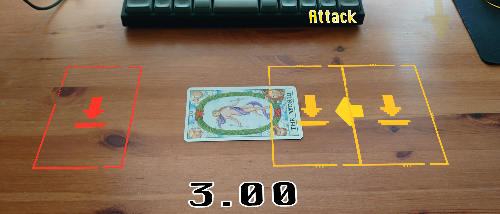
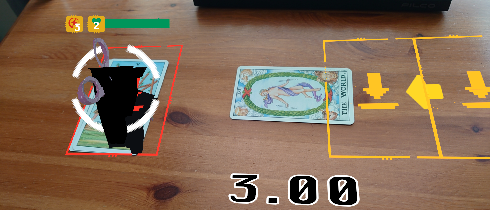

Check out **RPS's**
- 💾 [**Project Files**](https://github.com/HenryHa993/ARCardGame)

## About
RPS is an augmented reality card battler, built using **Unity** and **C#**. This was a unique opportunity to explore some of the challenges and limitations in mobile-based marker tracking, and marks my first major group project in Unity!

Here is our team:

- **Jamie Dowson** (Design)
- **Henry Ha** (Programming)
- **Damian Lau** (Design)
- **Cindy-Madeleine N'Gbama Missambi** (Animation)
- **Nan Yi** (Art)

## Technical Overview
This section will explore my contributions as a programmer on the project, in chronological order.

### Marker Manager
From conception, we knew we needed support for mapping different markers to different prefabs. This was necessary to spawn different units in the game, and Unity's tracking systems lacked the support for it.

The marker manager contains a dictionary mapping strings to prefabs. When a tracked image is detected, the name of the reference image is used to lookup and spawn the appropriate prefab.

```cpp
// Get prefab, spawn game object and store unique game object into dictionary
foreach (ARTrackedImage addedImage in addedImages)
{
    GameObject prefab = _namedPrefabs[addedImage.referenceImage.name];
    GameObject spawnedGameObject = Instantiate(prefab, addedImage.transform);
    _trackedObjects.Add(addedImage.trackableId.ToString(), spawnedGameObject);
    _trackedImages.Add(addedImage);
}
```

See [`Assets/Scripts/MarkerManager.cs`](https://github.com/HenryHa993/ARCardGame/blob/main/Assets/Scripts/MarkerManager.cs)

### Turn-Based system
To blend the real and virtual space, we decided to encapsulate the turn-based system within an AR play board. It contains two player sides, which uses triggers to detect when a unit has entered the field.



#### Turn End
When it is a player's turn to attack, the board will reveal an attacking zone. Should the player wish to end a turn, they will move the unit forwards. This will then initiate a countdown for the player to commit to an attack.

This countdown was implemented to address the off-screen tracking of the markers. In playtesting, we found that off-screen tracking was often unreliable, causing game objects to move randomly when out of sight. The countdown prevents unintentional, sudden turn endings.

```cpp
private IEnumerator Countdown()
{
    float time = 3f;

    while (time > 0)
    {
        time -= Time.deltaTime;
        CountdownUI.SetText(time.ToString("F2"));
        yield return null;
    }
    CountdownUI.SetText("3.00");
    OwningBoard.OnEndTurn();
}
```

See [`Assets/Scripts/TurnRinger.cs`](https://github.com/HenryHa993/ARCardGame/blob/main/Assets/Scripts/TurnRinger.cs)

### Units
Units in RPS share common values such as health, damage and a status type. When scanned, they show an icon denoting their type. They will then spawn the character model once taken into play.



In play, they have different attack values depending on the opponent's type. 

```cpp
public IEnumerator Attack(Unit unit)
{
    Element defendingType = unit.ElementType;

    UnitAnimator.SetTrigger("PlayAttack");
    yield return null;
    
    while ((UnitAnimator.GetCurrentAnimatorStateInfo(0).normalizedTime) % 1 < 0.99f)
    {
        Debug.Log("Animation ongoing");
        yield return null;
    }
    
    if (ElementType == defendingType)
    {
        unit.ApplyDamage(Damage);
    }
    else if (ElementAdvantages[ElementType] == defendingType)
    {
        unit.ApplyDamage(2*Damage);
    }
    else
    {
        unit.ApplyDamage((int)(0.5 * Damage));
    }
    
}
```

See [`Assets/Scripts/Unit.cs`](https://github.com/HenryHa993/ARCardGame/blob/main/Assets/Scripts/Unit.cs)

#### Animation Integration
When integrating Maddie's animations, I noticed that both the attacking unit's attack animation and the defending unit's damaged animation would occur at the same time.

To address this, the Unit's `Attack()` function utilises coroutines to correctly time both animations and damage logic.

<iframe width="560" height="315" src="https://www.youtube.com/embed/Os6EykcDa5o?si=0sYEsJulLpkfNkdz" title="YouTube video player" frameborder="0" allow="accelerometer; autoplay; clipboard-write; encrypted-media; gyroscope; picture-in-picture; web-share" referrerpolicy="strict-origin-when-cross-origin" allowfullscreen></iframe>

See [`Assets/Scripts/Unit.cs`](https://github.com/HenryHa993/ARCardGame/blob/main/Assets/Scripts/Unit.cs)

#### Unit tracking
As the game relies on moving markers, detailing to the player whether a unit was actively tracked was essential. Accessing the marker's `TrackingState` allowed me to implement an indicator that would notify the user when a unit could be moved.

This was implemented in the marker manager, as shown below:

```cpp
// If ARImage is actively tracked, indicate this on unit.
foreach (ARTrackedImage trackedImage in _trackedImages)
{
    Unit trackedUnit = _trackedObjects[trackedImage.trackableId.ToString()].GetComponent<Unit>();

    if (trackedUnit == null)
    {
        continue;
    }

    bool isTracked = false;

    switch (trackedImage.trackingState)
    {
        default:
            isTracked = false;
            break;
        case TrackingState.Tracking:
            isTracked = true;
            break;
    }
    
    trackedUnit.SetIsTracked(isTracked);
}
```

See [`Assets/Scripts/MarkerManager.cs`](https://github.com/HenryHa993/ARCardGame/blob/main/Assets/Scripts/MarkerManager.cs)

#### UI
Nan Yi and Damian were the main drivers behind the design of the UI. I adapted initial designs into the game using world space canvas elements and billboarding techniques. I also implemented UI animation scripts to fade and spin elements in-game.

See:

[`Assets/Scripts/UnitBoardUI.cs`](https://github.com/HenryHa993/ARCardGame/blob/main/Assets/Scripts/UnitBoardUI.cs)

[`Assets/Scripts/UI_Animations`](https://github.com/HenryHa993/ARCardGame/tree/main/Assets/Scripts/UI_Animations)

## Showcase

<iframe width="560" height="315" src="https://www.youtube.com/embed/c-uy6MV_Zmk?si=vf3wplcIlfLiK225" title="YouTube video player" frameborder="0" allow="accelerometer; autoplay; clipboard-write; encrypted-media; gyroscope; picture-in-picture; web-share" referrerpolicy="strict-origin-when-cross-origin" allowfullscreen></iframe>

## Reflection
Overall, despite the limitations of marker tracking I am proud of the product our team has created. Playtesting has allowed us to pivot appropriately in our design and implementation, as well as develop responses to some of the weaknesses of tracking.

Despite the accessibility of mobile marker tracking, it was simply not powerful enough to perform the kind of experience we were creating. If we were to restart, using a headset would have been much more appropriate.

For me, the most challenging part of the project was working around the weaknesses of mobile marker tracking. Initial playtests without the tracking indicators were difficult, and as a result the project pivoted greatly throughout development. Namely, design of the game was simplified to reduce the amount of markers required. For example, we had initially hoped to have two active units on each player side but found the reliance on accurate tracking too great to pursue.